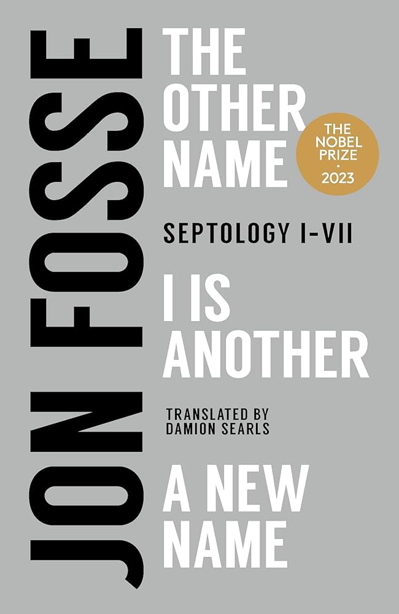

*Jon Fosse's Septology (I-VII)*

## Favorite Quote

*“and what the picture is in reality is this spirit, that’s what a picture really is, neither matter nor soul but both parts at the same time and together they make up what I think of as spirit, and maybe that’s why my good paintings, yes, all good paintings, have something to do with what I, what Christians, call The Holy Spirit, because all good art has this spirit, good pictures, good poems, good music, and what makes it good is not the material, not matter, and it’s not the content, the idea, the thought, no, what makes it good is just this unity of matter and form and soul that becomes spirit, that’s what culture is, probably, he says, it’s probably just one person being like another person that creates a culture, for example wearing a suit and tie, while what art is, yes, art is everyone just being like themselves, and totally themselves”*

**Author:** Jon Fosse  
**Published:** 2019-2021  
**Genre:** Literary Fiction  
**Length:** 824 pages (complete trilogy)  

## First Impressions

I'm left with no words. However, I am filled with emotion and a sense of spiritual fulfillment. I think the best way to describe this book is to not describe it at all. Merve Emre has already said it best in [Book Forum](https://www.bookforum.com/print/2904/writers-on-their-favorite-books-of-2022-25159), *"to describe what Septology is about—or even to claim that it is about something that can be fixed in words—is already to defile it."*

## The Writing Style

This is by far the most unique prose I have ever read. The entire trilogy is written in a single, unbroken sentence. This sentence is the seemingly endless stream of consciousness of the protagonist, Asle, in the days leading up to Christmas. There are times where I felt like I was swept away by that stream, and entered a trance-like state. Feeling Asle's feelings and thinking his thoughts. I felt the delineation between myself and Asle melt away. 

## Key Themes

- Spirituality
- Art
- Culture
- Grief

## What Worked Well

### Strength 1

I thought the writing style was one of the greatest strengths of the trilogy. Though I underestand that it may not be for everyone. You either get it or you don't - and if you do, it is an incredible experience.

### Strength 2

It did not feel preachy, like many other books that attempt to discuss spirituality. It approached the subject with a sense of humility and a genuine curiosity about the intersection of faith, art, and culture - and how individuals experience this intersection, and how they can channel this convergence into their own lives.

## What Could Have Been Better

### Point 1

For one, it is incredibly difficult reading each of the three books in the trilogy consecutively. I found it necessary to take breaks between books to digest what I had read. 

## Memorable Passages

> *“how it has to be, it must have a meaning, yes, Our Lord must have given it meaning, they think, he writes straight on crooked lines, they think, or anyway the good Lord is part of it all somehow, and it’s the devil who made the lines crooked, they think and they hold onto their cigarettes and pints and then they pray a silent prayer, a prayer more like a look out over the sea inside them, wordless, but as far as the eye can reach over that sea the prayer extends, entirely wordless, because the words will be left behind, definitely, but there must be a port for people like them too, they’re probably thinking, and then they feel a prick of something like fear so they raise their pint and have a taste of beer, the good old taste, it gives them a sense of security, I”*

> *"...there inside the person is what will pass away and become one with what is invisible in everything.."*

## Final Thoughts

I would recommend this book to anyone who is looking for a unique and thought-provoking read. Religious or not, this book evokes a sense of spirituality in the reader that is both humbling and uplifting.

⭐⭐⭐⭐⭐ (5/5)

---
*Read from [2024-09-19] to [2025-01-16]*

**Related Reading:**
- Stoner by John Edward Williams

-